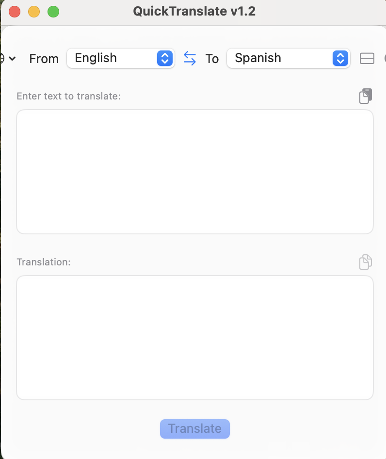

# QuickTranslate


⚠️ **Security Notice**: This application contains digital watermarks and protection measures. Unauthorized copying, modification, or distribution is strictly prohibited. See [SECURITY.md](SECURITY.md) for details.

[English](#english) | [Русский](#русский)

# English

QuickTranslate is a convenient macOS application that allows you to quickly translate text between different languages. The app appears in the menu bar and provides a simple, intuitive interface for instant translation.

## ✨ Features

- 🚀 Quick access through the menu bar
- 🌍 Support for multiple languages:
  - English
  - Spanish (Español)
  - French (Français)
  - German (Deutsch)
  - Italian (Italiano)
  - Portuguese (Português)
  - Russian (Русский)
  - Chinese (中文)
  - Arabic (العربية)
  - Hindi (हिन्दी)
- 🔄 Automatic translation while typing
- 🎨 Light and dark theme support
- 📱 Adaptive interface (horizontal/vertical layout)
- 📋 Copy/paste from clipboard
- 🌐 Localized interface in all supported languages

## 📸 Screenshots




## 💾 Installation

1. Download the latest version from the [Releases section](https://github.com/nikevdok/QuickTranslateMac/releases)
2. Unzip the archive
3. Drag QuickTranslate app to your Applications folder
4. Launch the app from Applications folder

## 📝 Usage

1. Click on the app icon in the menu bar
2. Enter text to translate in the upper field
3. Select source and target languages
4. Translation appears automatically
5. Use copy/paste buttons to work with clipboard

## 🛠️ Development

### Requirements
- macOS 13.0 or higher
- Xcode 14.0 or higher
- Swift 5.0 or higher

### Building from source
1. Clone the repository:
```bash
git clone https://github.com/nikevdok/QuickTranslateMac.git
```
2. Open the project in Xcode:
```bash
cd QuickTranslateMac
open QuickTranslate.xcodeproj
```
3. Build the project (⌘B)

## 📄 License

This project is licensed under a modified MIT License. Key terms include:
- Commercial use requires explicit written permission
- Derivative works must include original copyright notice and repository link
- Modifications must be clearly documented and attributed
- The software may not be used in ways that compete with the original project

See the [LICENSE](LICENSE) file for complete terms and conditions.

## 👨‍💻 Author

[Nikita Evdokimov](https://github.com/nikevdok)

## 🙏 Acknowledgments

- [MyMemory API](https://mymemory.translated.net/) for providing translation service
- [SwiftUI](https://developer.apple.com/xcode/swiftui/) for the amazing framework
- [Apple](https://www.apple.com) for macOS and development tools

---

# Русский

QuickTranslate - это удобное приложение для macOS, которое позволяет быстро переводить текст между различными языками. Приложение отображается в строке меню и предоставляет простой и интуитивно понятный интерфейс для мгновенного перевода.

## ✨ Особенности

- 🚀 Быстрый доступ через строку меню
- 🌍 Поддержка множества языков:
  - Английский (English)
  - Испанский (Español)
  - Французский (Français)
  - Немецкий (Deutsch)
  - Итальянский (Italiano)
  - Португальский (Português)
  - Русский
  - Китайский (中文)
  - Арабский (العربية)
  - Хинди (हिन्दी)
- 🔄 Автоматический перевод при вводе
- 🎨 Поддержка светлой и темной темы
- 📱 Адаптивный интерфейс (горизонтальный/вертикальный режим)
- 📋 Копирование/вставка из буфера обмена
- 🌐 Локализованный интерфейс на всех поддерживаемых языках

## 📸 Скриншоты


## 💾 Установка

1. Скачайте последнюю версию приложения из [раздела Releases](https://github.com/nikevdok/QuickTranslateMac/releases)
2. Распакуйте архив
3. Перетащите приложение QuickTranslate в папку Applications
4. Запустите приложение из папки Applications

## 📝 Использование

1. Нажмите на иконку приложения в строке меню
2. Введите текст для перевода в верхнее поле
3. Выберите исходный и целевой языки
4. Перевод появится автоматически
5. Используйте кнопки копирования/вставки для работы с буфером обмена

## 🛠️ Разработка

### Требования
- macOS 13.0 или выше
- Xcode 14.0 или выше
- Swift 5.0 или выше

### Сборка
1. Клонируйте репозиторий:
```bash
git clone https://github.com/nikevdok/QuickTranslateMac.git
```
2. Откройте проект в Xcode:
```bash
cd QuickTranslateMac
open QuickTranslate.xcodeproj
```
3. Соберите проект (⌘B)

## 📄 Лицензия

Этот проект распространяется под модифицированной лицензией MIT. Основные условия:
- Коммерческое использование требует явного письменного разрешения
- Производные работы должны включать оригинальное уведомление об авторских правах и ссылку на репозиторий
- Модификации должны быть четко документированы и атрибутированы
- Программное обеспечение не может использоваться способами, конкурирующими с оригинальным проектом

Полные условия использования смотрите в файле [LICENSE](LICENSE).

## 👨‍💻 Автор

[Никита Евдокимов](https://github.com/nikevdok)

## 🙏 Благодарности

- [MyMemory API](https://mymemory.translated.net/) за предоставление сервиса перевода
- [SwiftUI](https://developer.apple.com/xcode/swiftui/) за прекрасный фреймворк
- [Apple](https://www.apple.com) за macOS и инструменты разработки 